## 도입 이유

현재 운영중인 서비스에는 에러 메시지 로그를 쌓고 있기는 하다. 하지만 이 로그를 보고 어떻게 발생했는지에 대한 과정은 알 수가 없으며, 코드를 일일히 확인해보고 개발자가 직접 에러를 트리거해보면서 에러를 발견하여 수정하거나 그래도 발견되지 않는다면 에러가 발생한 유저에게 직접 문의를 해서 해결했었다.

이러한 일련의 과정들을 Sentry 서비스를 활용해서 어느정도 해소할 수 있다.

Sentry는 해당 이벤트 로그(=에러 로그)에 대한 다양한 정보를 제공해준다.

- Device: 이벤트 발생 장비 정보
- OS: 이벤트 발생 OS wjdqh
- Browser 이벤트 발생 브라우저 정보
- Exception & Message: 이벤트 로그 메시지와 코드 정보 등을 제공(source map을 설정해야함. @sentry/nextjs는 sourcemap을 자동으로 생성하여 업로드한다.)
- **Breadcrumbs**: 이벤트 발생 과정(= 유저의 행동 데이터)
- **Context**: 기본적으로 해당 이벤트 환경의 정보와 개발자가 추가한 정보를 제공

또한 Sentry는 이벤트 로그들을 그룹화해준다.

그룹화의 기준은 Stack Trace >Exception > Message 순으로 그룹핑해준다.

## 개선사항 분석

### 현재 상황

- 별도의 ErrorHandler 함수를 만들어 backend API 호출
- ErrorHandler는 에러에 대한 전체 메시지를 던져주므로 별도의 타입 구분을 않하고 있음
- backendAPI에서는 request body로 전달받은 에러 객체를 풀어서 유저정보를 포함하여 텔레그램 알림 API 호출

### 개선해야될 부분

- 에러에 대한 분리가 필요
- severside, clientside 에러를 구분해서 사용중이나 동일한 함수명으로 인한 휴먼 에러 발생 가능성이 높음
- 굳이 backend API로 보낼 필요없이 클라이언트 내부에서 api를 호출해서 사용할 수 있을 듯

**에러메시지를 커스텀 해줘야 하는 이유**

기존코드

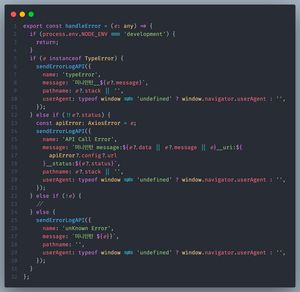

utils/handledError 함수

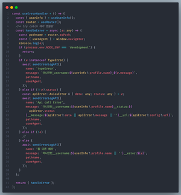

useErrorHandler

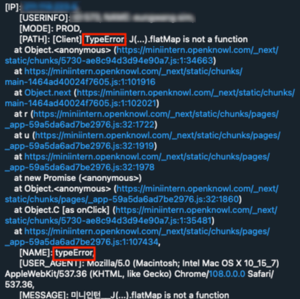

error message - Path 주목

1. 함수의 경우 페이지 내부 컴포넌트에서 발생하는 것이 아닌 에러 핸들링하는데 사용하는 것

2. 페이지 내부 컴포넌트에서 발생하는 에러를 핸들링하는데 사용하는 것

두 개를 분리한 이유는 message(유저정보 포함여부)와 pathname이 나뉘기 때문이라고 생각이 된다.

useErrorHandler의 경우 유저정보를 포함할 수 있고, Server Side에서의 에러는 유저정보(Client Side에서 호출)를 사용할 수 없기 때문에 유저정보를 불러오지 못하므로 별도의 내용물을 전달해야한다.

이렇게 처리하더라도 클라이언트, 즉 컴포넌트 내부에서 Error가 발생하였을때 useErrorHandler를 활용하더라도 componentDidMount에서 handleError를 처리했을 경우에 유저정보를 받아오지 못하는 것은 매한가지다.(회원정보를 클라이언트 사이드에서 호출하기 때문에)

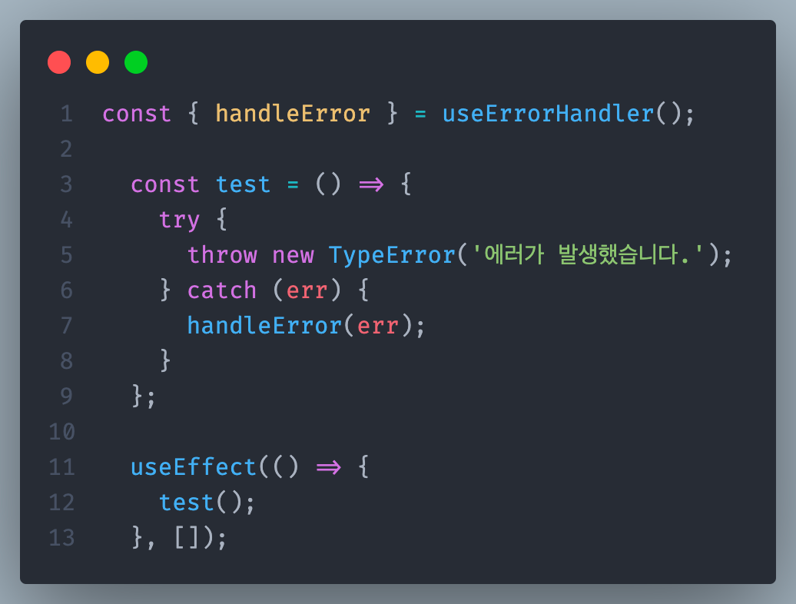

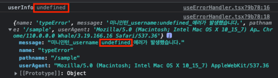

클릭 이벤트에서 에러 발생시 유저 정보는 가지고 있으므로 우리가 예상한 결과로 메시지가 만들어진다.

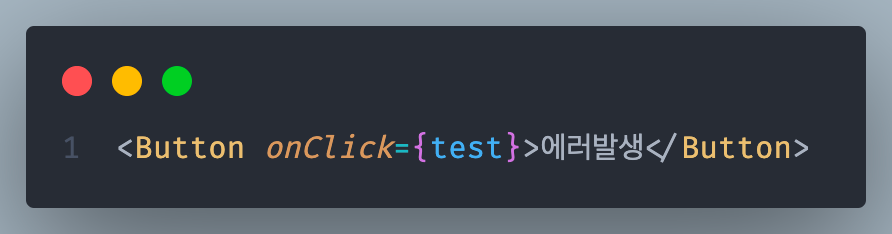

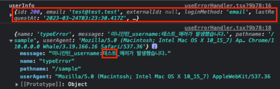

굳이 나눠야할 필요성이 있을까 싶다.

그리고, 백엔드 환경에서 클라이언트에서 보낸 데이터를 사용하지 않고, passport에 정보를 불러와서 사용한다.

또한 utils/handleError 함수는 pathname에 [errot stack](https://developer.mozilla.org/en-US/docs/Web/JavaScript/Reference/Global_Objects/Error/Stack)을 넣어서 보내주는데 이것이 텔레그램 메시지에는 누락되는 경우도 존재한다.

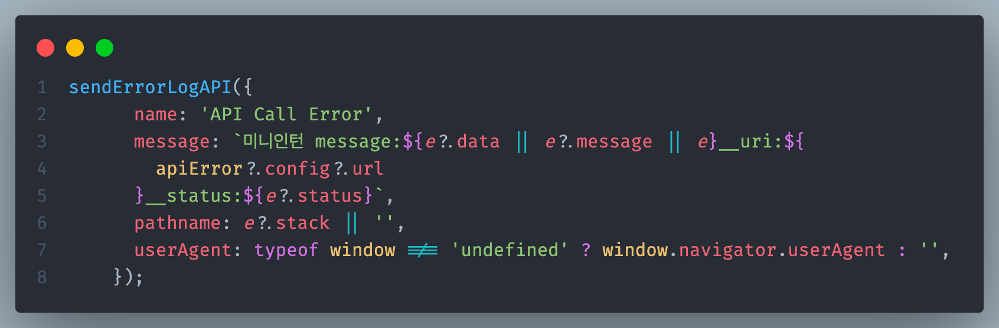

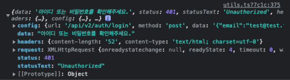

err 객체에 stack이 존재하지 않는다.

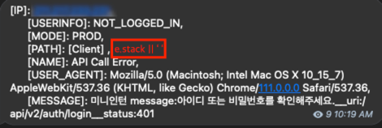

e.stack이 비어있는 것을 확인할 수 있다

클라이언트 코드를 확인해보자.

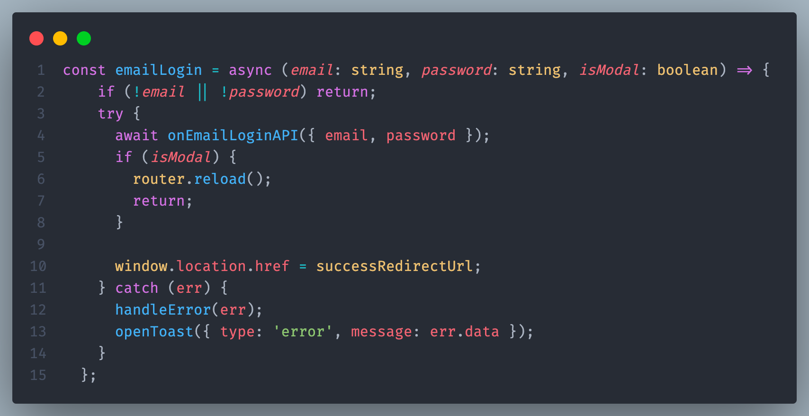

handleError는 catch문에 잘 작성되어 있다.

무엇이 문제일까?

바로 utils/handleError를 사용했기 때문에 e.stack을 찾았던 것이다. 로그인 함수는 클라이언트에서 사용되어 useErrorhandler에 handleError를 사용했어야한다.

useErrorHandler의 handleError를 사용해보자.

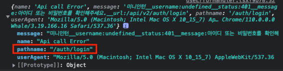

이처럼 동일한 함수명으로 인해 휴먼 에러가 발생할 수가 있다.

이를 서버 사이드/클라이언트 사이드 구분없이 통일하면 좋을 것 같다.

그렇다면 통일해야되는 부분이 어느 것이 있을까, 에러를 처리하는데 있어서 유용한 정보가 무엇이 있을까라는 고민을 해보자.

공통

- 서버 환경
- 에러 타입
- 에러 상세 메시지
- 에러 발생한 페이지 위치

추가적으로

- API 에러라면 에러가 발생한 API Route에 대한 정보
- 에러를 발생시킨 유저의 계정 정보

정도가 필요하다고 생각된다.

## Sentry 도입

### Sentry 동작 원리

**Something Component**

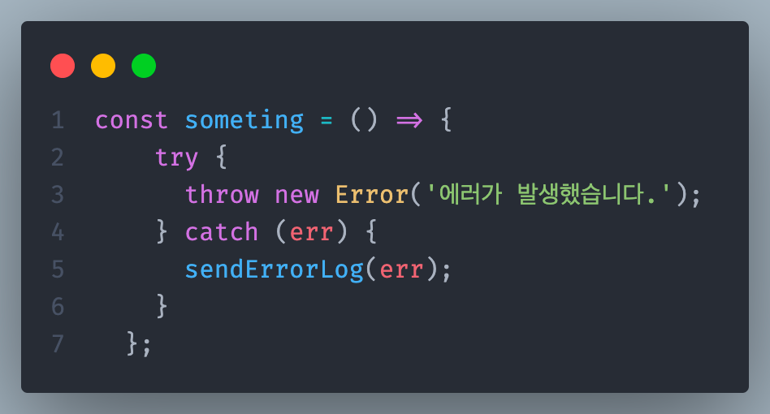

해당 함수를 실행했을때

**sendErrorLog 함수**

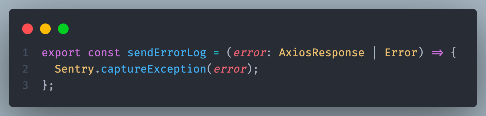

sendErrorLog 함수는 Sentry에 captureException 메소드를 호출하여

Sentry에 정보를 전달한다.

### Sentry는 어떻게 에러를 감지할까?

사용자가 애플리케이션에 Sentry SDK를 설치하여 에러를 추적할 수 있다.

Sentry SDK는 브라우저에서 발생하는 에러를 추적하기 위해 window 객체에 이벤트 리스너를 추가한다.

이 이벤트 리스너는 에러가 발생할 때마다 SDK가 해당 에러를 추적하여 추적된 정보를 Sentry에 전송한다.

요약하면 브라우저 콘솔을 추적하는 것이 아니라 SDK를 통해 브라우저에서 발생하는 에러를 추적한다.

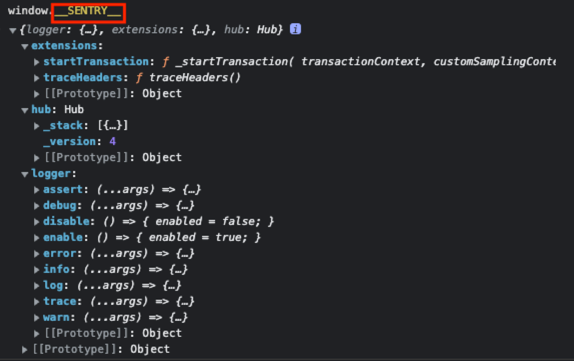

window의 sentry 객체

Sentry에 전달하기전에 sentry initialize에 beforeSend 메소드를 사용했다면 beforeSend 메소드를 먼저 처리한 후 Sentry에 전달한다

beforeSend Method를 통해서 event에 대한 정보와 hint(원본 데이터)를 전처리 할 수 있는데,

이를 활용하여 텔레그램으로 알림을 보낼 경우 event와 hint에 대한 정보를 얻어 가공하여 알림을 보내려고 한다.

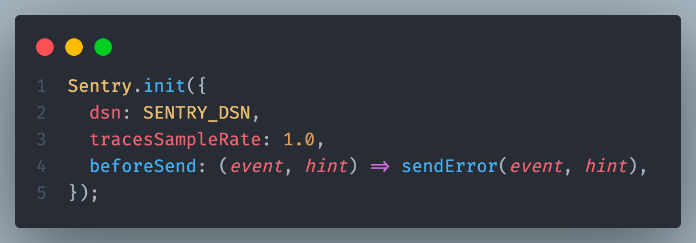

sendError에서 hint에

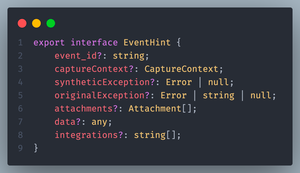

hint: EventHint

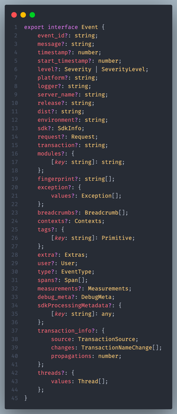

event: ErrorEvent

위와 같은 애들을 활용하여 텔레그램에 정보를 가공해서 알려줄 필요가 있다.

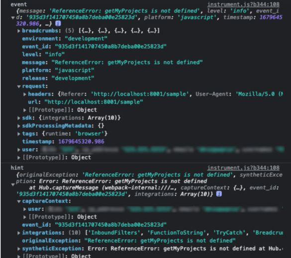

client/Reference Error

**예시코드를 활용하여 가공하기 좋은 데이터를 분석해보자**

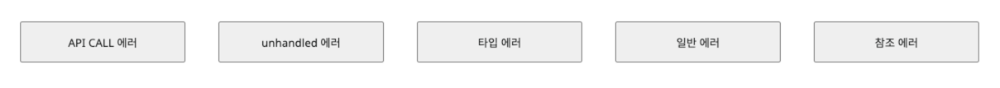

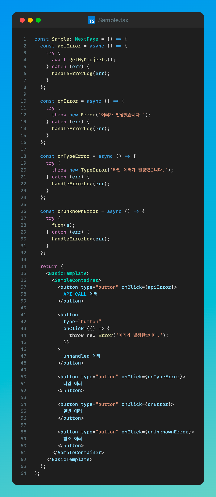

하지만 런타임에 발생할 수 있는 Error와 API 호출에서 발생하는 에러는 hint.originException에서 차이점이 존재한다.

**각 에러마다의 hint.originException에 집중하자**

1. API Call Error의 경우 - AxiosError 객체가 들어가 있다.

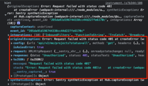

axios의 error 객체가 들어가 있는 것을 확인할 수 있다.

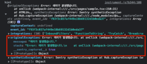

핸들링(catch)되지 않는 에러의 경우

1. API Call Error가 아닌 경우 - Error 객체가 들어가 있는 것을 확인할 수 있다.

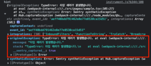

타입 에러가 발생 했을 경우

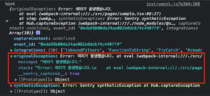

일반 에러가 발생했을 경우

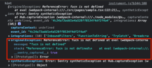

참조 에러가 발생했을 경우

hint의 originalExceptions의 속성을 활용하기 위해서는 Axios의 에러와 분류하기 위해 코드의 복잡성이 올라갈 것이다.

그렇다면 hint와 같이 전달받을 수 있는 **event:ErrorEvent**는 어떻게 생겼을까?

1. API Call Error의 경우

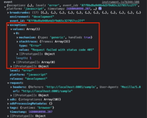

event.exception에 예외에 대한 내용을 받는다.

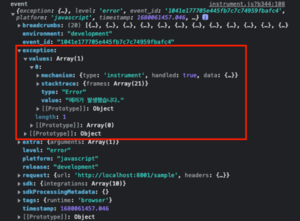

unhandledError의 경우

> 💡 **exception의 속성 내용** > **type**: 예외 유형(예, ValueError 등)
> **value**: 예외에 해당하는 값(문자열)
> module: 예외 유형이 있는 선택적 모듈 또는 패키지
> thread_id: 쓰레드 인터페이스의 스레드를 참조하는 선택적 값
> **mechanism**: [메커니즘](https://develop.sentry.dev/sdk/event-payloads/exception/#exception-mechanism)을 설명하는 선택적 객체 예외
> **stacktrace**: 스택 추적 인터페이스에 대한다는 선택적 스택 추적 개체
> …

1. API Call Error가 아닌 경우

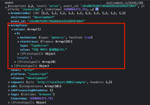

타입 에러가 발생한 경우

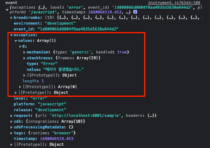

일반 에러가 발생한 경우

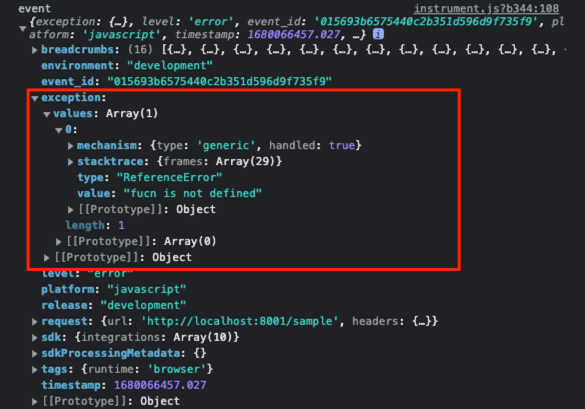

참조 에러가 발생한 경우

exception.values를 활용하기에는 코드상으로 exception.values[0] 이런식으로 첫번째 노드로 접근해야하는데 첫번째라는 보장이 있는가에 대한 나의 생각은 “확실하지 않다” 라는 판단이 선다.

에러를 핸들링하기 위해 확실하지 않는 방법을 사용하는 건 옳지 않다.

또한, API Call Error에서 Value에서 에러 객체를 보여주므로, 어떤식의 에러인지 명확하게 메시지를 전달하고 싶은 나에게는 맞지 않았다.

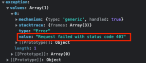

API Call Error의 event.exception 내용네

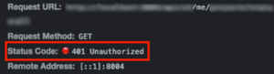

네트워크 탭에서의 API Call에 대한 내용

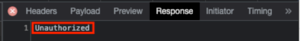

네트워크 탭에서의 API Call에 대한 Response 내용

event에서도 텔레그램 알림에 사용할 수 있는 원하는 정확하고 일관성 있는 메시지를 만들기는 어려워보인다.

그렇다면

unhandledError의 경우

또한 unhandledError의 경우 try/catch에서 핸들링을 따로 처리하지 않았는데도 handled 속성의 값이 true로 되어있다.

handled가 “true”인 이유는 Sentry에서 예외 처리 여부를 추적하기 위한 용도로 handled 속성을 사용하며, 기본적으로 예외가 처리되었다고 가정하여 이 속성을 “true”로 설정한다.

이렇게되면 모든 에러로그가 Sentry에 쌓을 수 있다.

그렇다면 위에 unhandledError로 인해 발생한 에러는 try/catch로 핸들링이 되어있지 않았으므로 false로 변경해줘야하는데 문제가 없을까?

문제없다. Sentry에서는 handled 속성을 추적을 위해 사용할 뿐 handled 속성이 true인지 false인지 상관이 없다. 공식문서에서 설명했 듯 handled(선택적 플래그)를 개발자 임의로 설정이 가능하기 때문이다.

handled 속성으로 에러 핸들링이 되지 않은 부분을 처리하는 것은 매우 중요하기 때문에 **unhandledError의 경우 handled 속성을 별도로 처리해줘야하는 요구사항이 추가된다.**

handled 속성을 별도 처리하게되면 Sentry의 필터기능을 활용하여 놓치는 부분을 쉽게 체크할 수 있다.

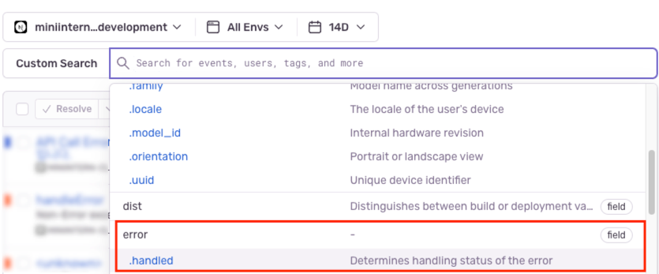

이 handled 속성의 처리는 뒤에 어떻게 처리하는지 설명하겠다.

### 에러 타입 메시지 정제

에러 타입에 따른 메시지를 정제하기 위해 대안 2가지가 있다.

1. Context를 활용
2. Custom 에러를 활용하여 에러에 커스텀 속성 추가(타입 캐스팅 용이)

**1.** **Context를 활용**

> 💡 **Context란?**
> 이벤트에 임의의 데이터를 연결할 수 있는 기능이다.
> 이벤트가 발생한 이벤트 로그에서 확인할 수 있다.

**에러 실행 코드**

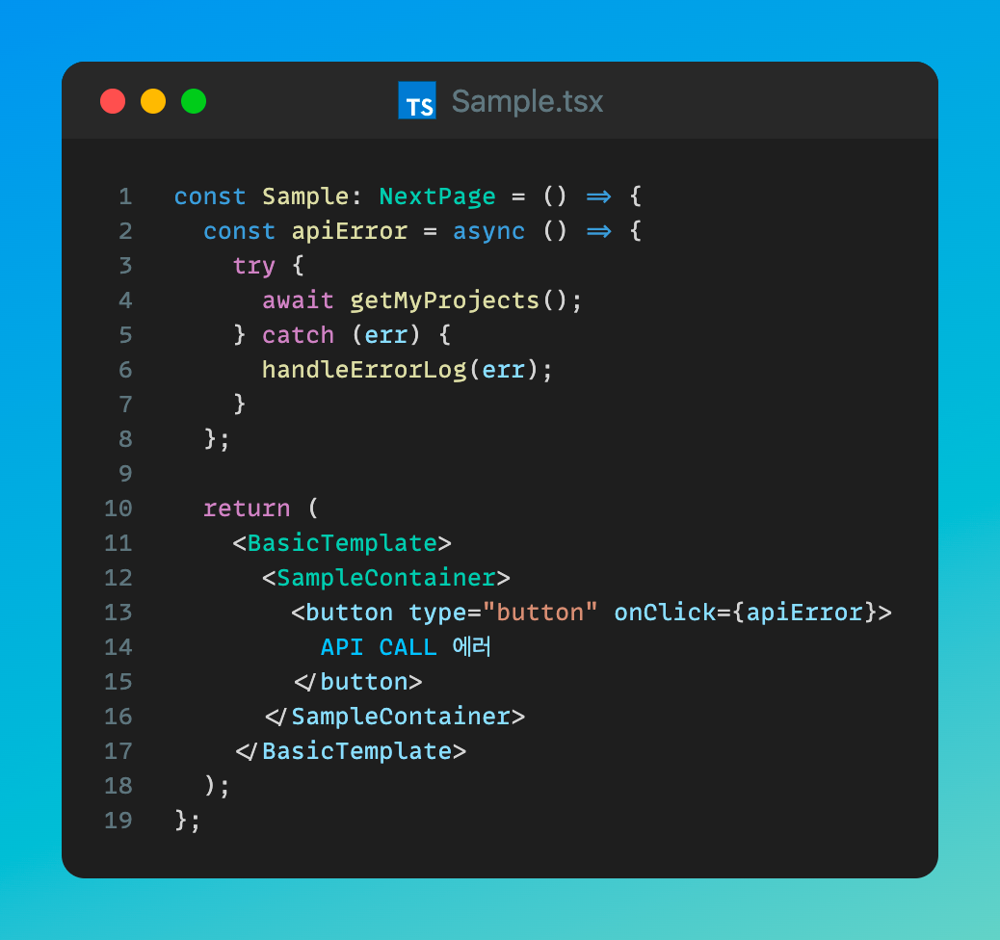

**코드 내용**

1. API CALL 에러 버튼 클릭시 apiError가 실행한다.
2. apiError 내부에 getMyProjects 함수를 호출한다.
3. getMyProjects는 유저정보가 필요로하는 요청이므로 UnAuthroized 에러가 발생
4. catch에서 handleErrorLog 함수를 호출하여 에러를 전달

**Sentry의 Context에 임의의 데이터를 추가하는 코드**

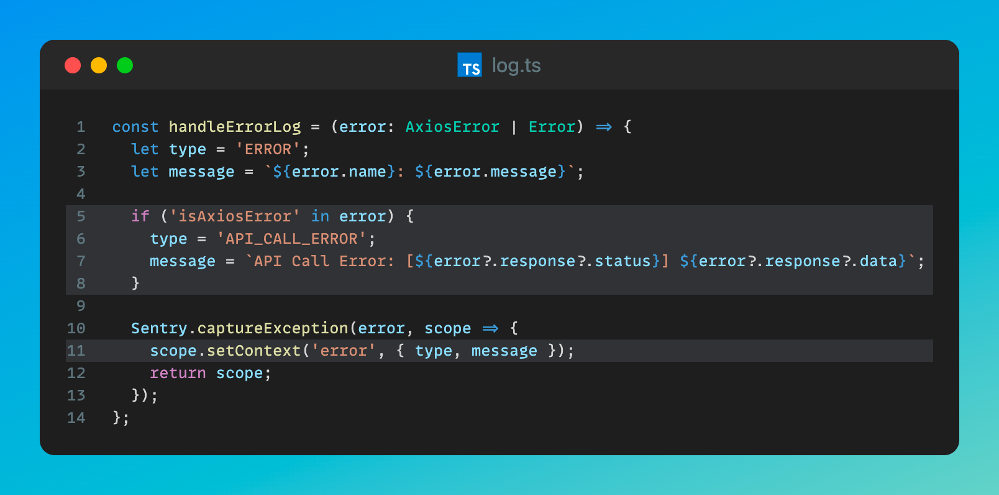

**코드 내용**

1. handleErrorLog는 error를 매개변수로 받는다.
2. error는 AxiosError와 Error 타입 중 하나이다.
3. AxiosError는 Error를 상속받으므로 error instanceof AxiosError로 구분할 수 없다.
4. AxiosError를 판별하기 위해 error에 isAxiosError 속성이 있는지 여부로 체크
5. type과 message를 정제해서 담아준다.(이때 default는 기본 Error에 대한 내용)
6. Sentry.captureException 메소드를 활용해서 Sentry에 내용을 적용

> 💡 **Sentry.captureException란?**
> 에러를 캡처하고 해당 예외에 대한 정보를 Sentry 서버로 보내어 오류를 추적할 수 있게 해주는 메소드이다.(나는 Sentry 에러 전송 트리거라고 이해했다.)

6-1. Sentry.captureException는 error와 captureContext를 인수로 받는다.

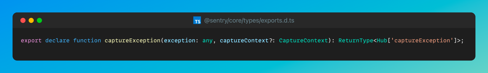

captureException의 타입 정의

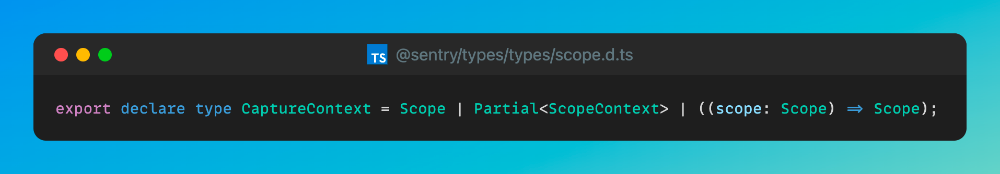

captureContext의 타입 정의

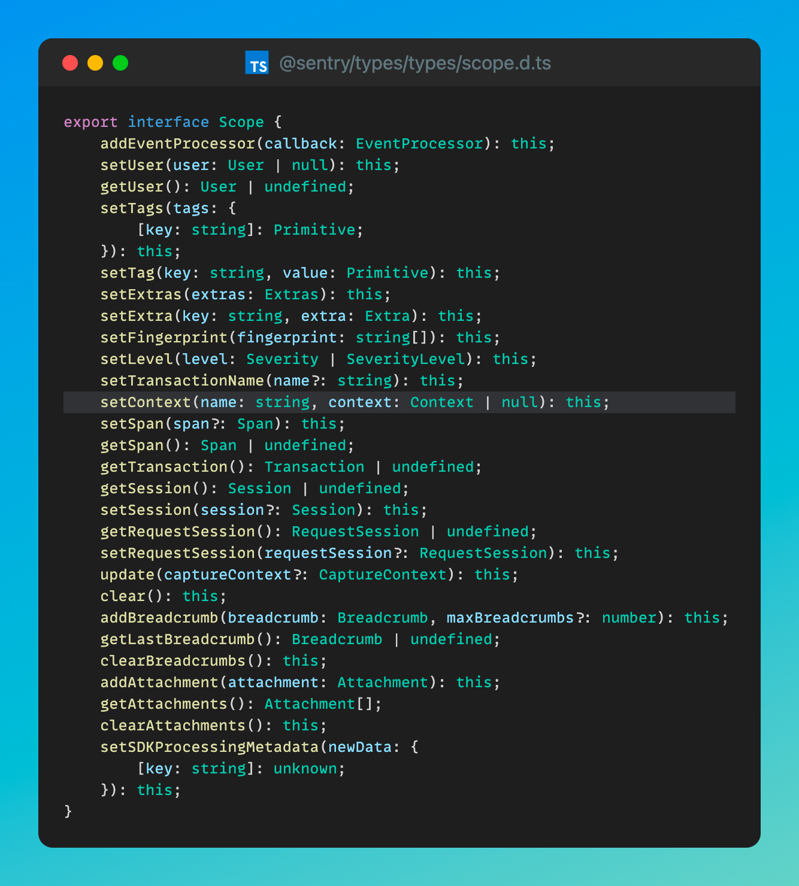

scope에 대한 타입 정의

6-2. captureContext로 콜백 함수 사용하여 context에 임의의 내용을 저장한다.

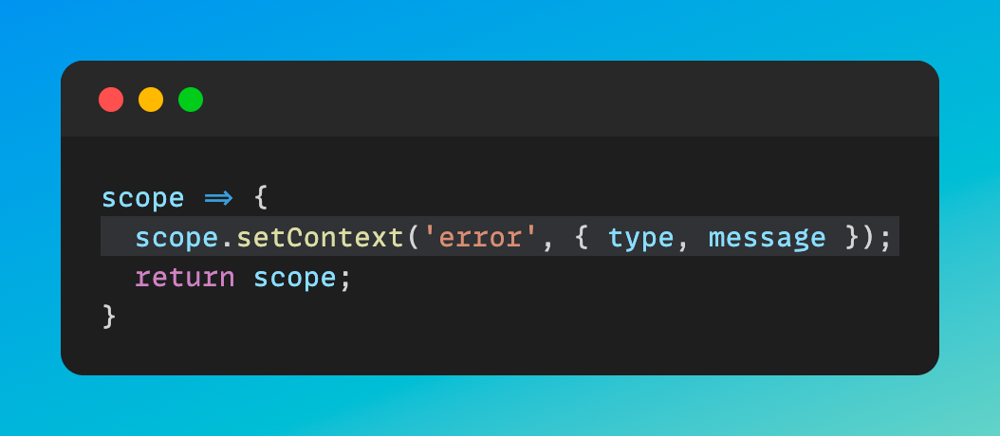

> 💡 **Sentry에서 Scope란?**
> Sentry는 scope 단위로 이벤트 데이터를 관리한다. scope는 해당 에러에 대한 스코프를 의미한다.
> 스코프는 Sentry에 전달할 에러에 대한 정보를 포함한다.(예를들어 context와 breadcrums)

capureExpection이 호출되면 Sentry에 데이터를 전송된다.

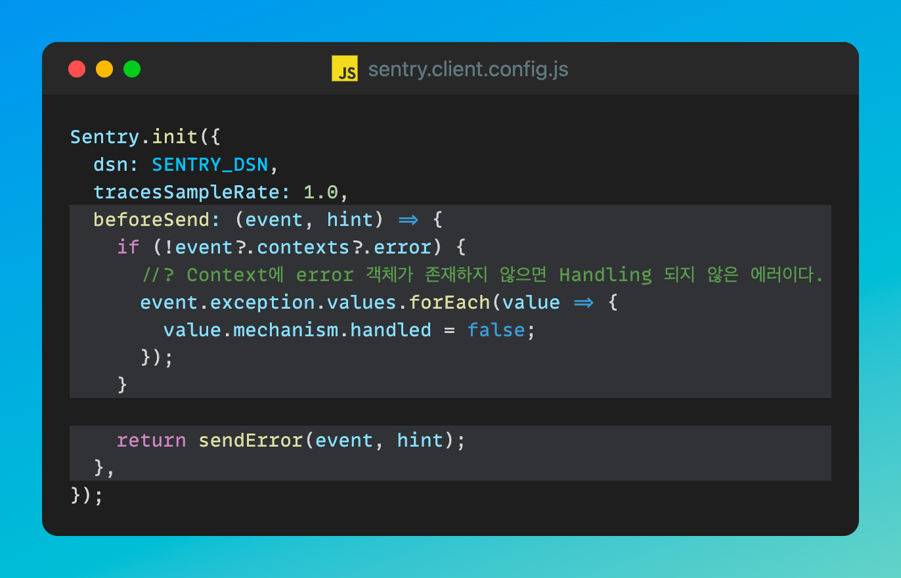

데이터를 전송하기 전 가공된 데이터를 텔레그램으로 보내줘야하므로, Sentry beforeSend 메소드를 활용해야한다.

1. 우리는 모든 핸들링한 모든 에러에 context에 넣어두었다. 만약 context에 error 객체가 존재하지 않다면 해당하는 에러는 개발자가 놓친 에러라고 판단할 수 있다.
2. 위에서 언급했 듯 Sentry의 모든 에러의 handled 속성 값이 true로 보내진다고 얘기했는데 이 분기처리에서 handled에 false를 할당하여 로그를 보는 사용자에게 에러가 핸들링이 되지 않고 있는 것을 알릴 수 있게 된다.
3. sendError를 통해 해당 event와 hint를 넘겨준다.

### 트러블슈팅

Sentry SDK를 적용했을때 [Localhost](http://Localhost) 환경에서 외부 API를 호출하면 CORS 에러가 뜨는 것을 확인했다.

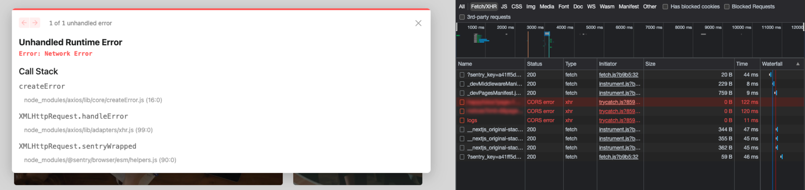

Sentry는 여러 서비스 관련 통합 및 NextJS 요청 중에 발생한 이벤트를 기록하는 프로세스이므로, Nextjs 뿐만 아니라 JS SDK는 생성되는 모든 트랙잭션 및 범위에 대해 필요에 따라 추적 헤더(sentry-trace와 bagage)를 자동 생성하고 선택하여 전파 한다.

추적 헤더를 자동 생성한다고 했고, 선택에 따라 자동 생성된 정보를 전달할 수 있다고 했는데 Sentry.BrowserTracing의 tracePropagationTargets 속성을 통해 선택할 수 있다.

tracePropagationTargets의 default 옵션은 ['localhost', /^\//]이다.

그러므로 테스트 환경인 [localhost](http://localhost) 환경에서 sentry-trace와 baggage를 자동 생성해서 외부 API 호출할때 Request Header에 전파하는 것이였다.

그래서 [localhost](http://localhost) 환경의 경우 공식문서에 따르면 API - Access-Control-Allow-Headers: **sentry-trace, baggage**를 추가해줘야한다고 한다.

이유는 Sentry에서 에러 추적을 위해 RequestHeader에 sentry-trace와 baggage를 첨부하기 때문에 다른 도메인에 요청할 경우 해당 도메인에서 sentry-trace와 baggage를 허용 안하게 되면 뜨기 때문이다.

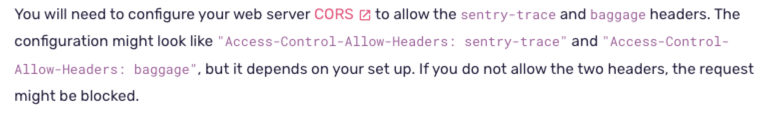

[Automatic Instrumentation for Browser JavaScript](https://docs.sentry.io/platforms/javascript/performance/instrumentation/automatic-instrumentation/#tracingorigins)

API 코드에서 Access-Control-Allow-Headers에 sentry-trace, baggage를 추가하면

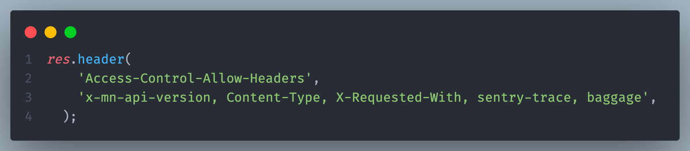

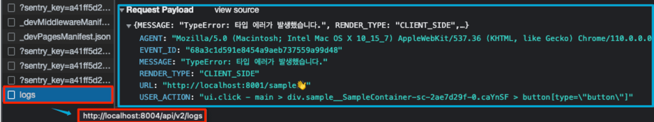

텔레그램 알림

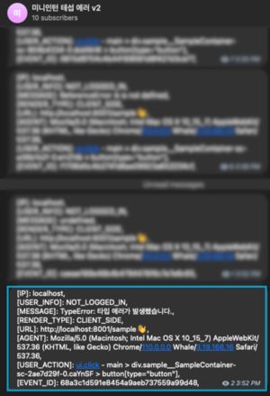

1. **Custom 에러를 활용하여 에러에 커스텀 속성 추가(타입 캐스팅 용이)**

Custom Error를 작성하면 코드 복잡성이 줄어든다. 특히나 if문 처리가 줄어들어 직관적으로 코드를 이해할 수 있다.

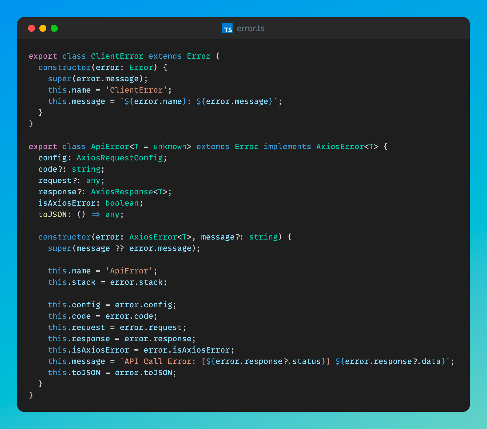

name - API 에러/Client 에러 구분할 수 있도록 지정

message - 기존 Sentry Context에 전송하기 전에 에러 타입에 맞게 message를 커스텀해줬다.

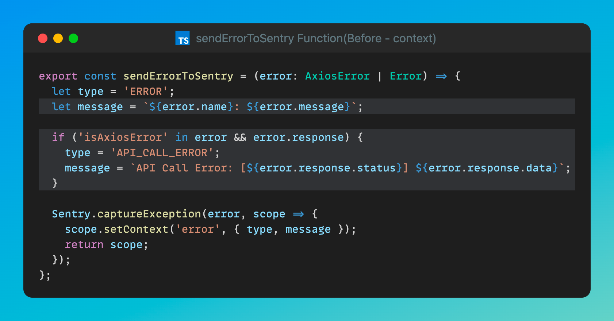

if문을 들여다보면 꽤나 복잡하다.

현재 sendErrorToSentry의 역할

1. API 에러인지 Client 에러인지 구분
2. 구분에 따른 타입과 메시지는 커스터마이징
3. 커스터마이징된 값을 Context에 넣어 Sentry에 알린다

변경된 코드를 보면

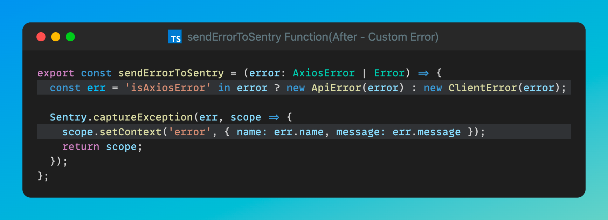

sendErrorToSentry 함수의 역할

1. API 에러인지 Client 에러인지 구분
2. 커스터마이징된 값을 Context에 넣어 Sentry에 알린다

위에 로직과 같이 API 에러인지 Client 에러인지 판단해야되는 건 변함이 없지만,

name(= type)과 message를 커스텀할 필요 없이(2번 사항) 커스텀 에러에서 내려주는 name과 mesage만 받아서 전달해주면 끝이므로 sendErrorToSentry의 역할이 명확해진다.

다음은 Backend API에 로그를 만들 경우이다.

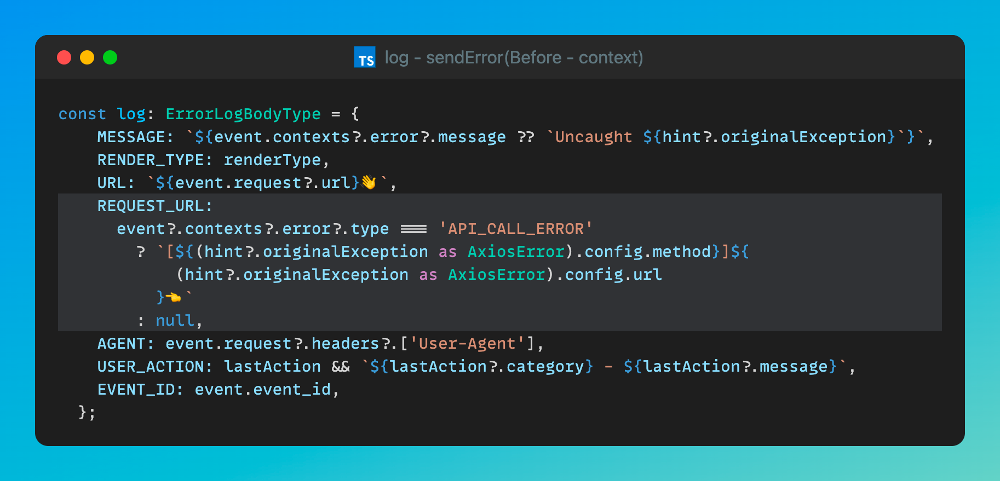

백엔드에 전달하기 위한 메시지를 만드는 코드이다.

문제는 REQUSET_URL에 대한 분기처리이다.

REQUSET_URL은 API 호출시 에러 발생했을때만 존재하므로 분기처리를 해줄 필요성이 있다.

하지만 이때 context의 error type으로 구분을 하더라도 hint.originalException이 ApiError인지 알 수가 없어 옵셔널 체이닝을 하거나 as를 활용하여 강제로 타입 지정해줘야된다.

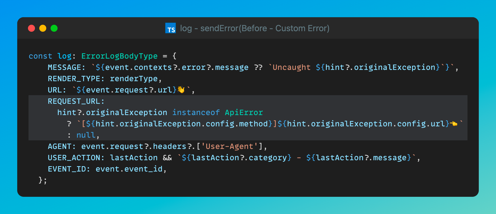

커스텀 에러를 사용하게 되면 instanceof로 ApiError인지 체크할 수 있게 되며 타입캐스팅을 할 수 있게 된다.
