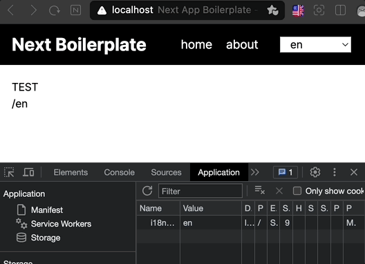
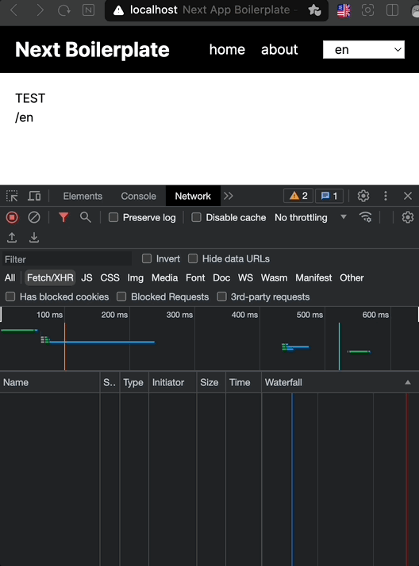
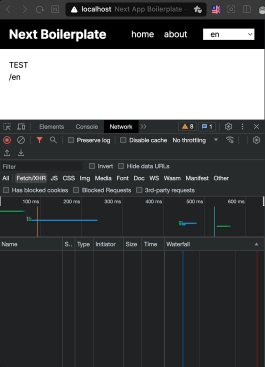

## 언어 변경시 쿠키와 라우팅 경로가 불일치하는 현상 해결하기

### 현재 미들웨어 구현 사항

```ts title="middleware.ts"
import { NextRequest, NextResponse } from 'next/server';
import acceptLanguage from 'accept-language';
import { fallbackLng, languages } from './i18n/settings';

acceptLanguage.languages(languages);

export const config = {
  matcher: [
    '/((?!api|_next/static|_next/image|images|fonts|videos|assets|favicon.ico|robots|sitemap|sw.js).*)',
  ],
};

const cookieName = 'i18next';

const getLanguageFromRequest = (req: NextRequest): string | null => {
  const language = req.cookies.has(cookieName)
    ? req.cookies.get(cookieName)?.value // 1
    : req.headers.get('Accept-Language'); // 2

  return acceptLanguage.get(language) || null;
};

export function middleware(req: NextRequest) {
  const language = getLanguageFromRequest(req) || fallbackLng; // 3
  const response = NextResponse.next();

  response.cookies.set(cookieName, language); // 4

  const languageInNextUrl = languages.find((loc) =>
    req.nextUrl.pathname.startsWith(`/${loc}`),
  );

  if (languageInNextUrl && language !== languageInNextUrl) {
    response.cookies.set(cookieName, languageInNextUrl);
  }

  // 5
  if (
    !languages.some((loc) => req.nextUrl.pathname.startsWith(`/${loc}`)) &&
    !req.nextUrl.pathname.startsWith('/_next')
  ) {
    return NextResponse.redirect(
      new URL(`/${language}${req.nextUrl.pathname}`, req.url),
    );
  }
}
```

1. '/' 로 접근시 특정 쿠키 값이 존재하면 해당 값에 해당하는 라우팅 세그먼트로 변경
2. 쿠키가 없다면 req.header accept-language로 설정된 값이 개발자가 설정한 언어 리스트에서 존재한다면 라우팅 세그먼트로 변경
3. 모두 해당하지 않는다면 개발자가 설정한 fallback 언어로 라우팅 세그먼트로 변경
4. 위 세가지에 절차를 마친 language 값을 쿠키에 저장
5. /{언어}가 아닌 다른 세그먼트 값으로 접근시 language 값을 첫번째 세그먼트에 세팅

위와 같은 middleware 설정시 개발자는 a 태그 또는 Link(next) 태그 그리고 router 사용시 pathname을 일관성있게 작업할 수 있게 된다.

### 테스트 시나리오

1. '/' 경로로 접근 > fallback 언어 redirect 정상 작동 `(예: '/' -> '/en')`
2. 루트 경로('/en') > 언어변경 정상 작동 `(예: '/en' -> '/th')`
3. 루트 경로 > about 페이지 이동 정상 작동 `(예: '/th' > '/th/about')`
4. about 페이지 > 언어 변경 > 변경된 언어의 루트 이동 정상 작동 `(예: /{변경 언어})`
5. 루트 > about 페이지 이동 _**쿠키는 정상 작동, routing 오작동**_



### 원인 파악

원인은 다름 아닌 NextJS 캐싱이 원인이였다.

현재 동작에서는 언어 설정 변경시 next/navigation의 `router.push`를 통해 라우팅을 변경해줬다.

next의 앱 라우터는 라우팅 탐색에 대해 하이브리드 접근 방식을 사용하고 있다.

- 서버 - 라우트 세그먼트별로 자동으로 애플리케이션 코드가 분할된다.
- 클라이언트 - Next.js는 라우트 세그먼트를 미리 가져오고 캐시한다.

이렇게 하는 이유는 사용자가 새 경로로 이동할 때 브라우저가 페이지를 다시 로드하지 않고 변경된 경로 세그먼트만 다시 렌더링하여 사용자 경험과 성능을 개선하기 위해서라고 한다.
[참고](https://nextjs.org/docs/app/building-your-application/routing/linking-and-navigating#how-routing-and-navigation-works)

### 해결 방안

언어 변경시 루트 경로로 라우팅 처리를 해주고 있다.

현재 라우팅 세그먼트를 유지할 필요가 없다면, `window.location.href`를 변경해서 브라우저 주소 값을 변경해서 페이지를 처음부터 다시 로드해도 될 것 같다.

개발자도구 > 네트워크 탭을 통해 원인이 맞는지 확인해보자.

- `router.push`를 통해 라우팅 했을 때



- `window.location.href`를 통해 라우팅 했을 때



### 결론

쿠키, routing 모두 동일하게 정상 작동한다.

하지만 `window.location.href`로 처리하는게 정답인지는 모르겠다.

만약 언어별 다른 도메인을 사용했다면 당연히 처리해야했지만 i18n 연동을 하여 동일한 도메인에 세그먼트만 동적으로 처리하다 보니 router.push로 당연히 될 줄 알았다.

언어 변경시에만 캐싱 처리를 회피하면서 next app router를 활용할 방안을 고민해야하는 숙제가 생겼다.
