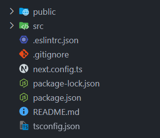
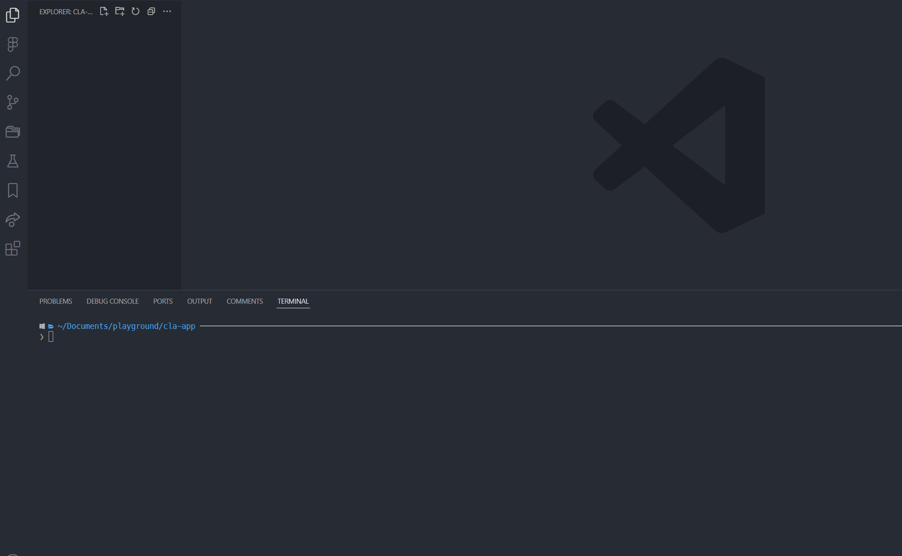

## 배경

### 기존 보일러플레이트 사용 방식의 문제점

개인 또는 업무 생산성을 위해 보일러플레이트를 사용하고 있다. 현재는 GitHub 저장소에 보일러플레이트를 올리고, 해당 내용을 clone하여 사용하는 방식을 채택하고 있다.

하지만 이런 방식으로 작업하다 보니 다음과 같은 번거로움이 발생했다:

- **매번 새로운 프로젝트마다 clone 작업**: 프로젝트 생성 시마다 git clone 명령어 실행
- **remote 변경 작업**: 기존 remote를 제거하고 새로운 remote로 변경
- **git 히스토리 정리**: 불필요한 git 히스토리 제거 작업
- **수동 설정 과정**: 프로젝트명, 설정값 등을 수동으로 변경

### 개선 방향

create-react-app과 같은 npx 실행 명령어로 처리하면 직관적이면서도 심플하게 보일러플레이트를 세팅할 수 있다고 판단하여, npx 명령어를 제작하기로 했다.

## npx란?

npm(Node Package Manager)의 일부로, Node.js 패키지를 전역적으로 설치하지 않고도 일회성으로 더 쉽게 실행할 수 있게 도와주는 도구이다.

### npx의 장점

- **디스크 공간 절약**: 실행 시에만 임시로 다운로드하고 실행 후 자동 삭제
- **항상 최신 버전 사용**: 매번 최신 버전을 다운로드하여 사용
- **유연한 버전 관리**: 프로젝트별로 다른 버전 사용 가능
- **보안 강화**: 실행 시 패키지 검증 및 악성 패키지 감지
- **명령어 간소화**: 복잡한 설치 과정 없이 바로 실행

### npm vs npx 비교

#### npm 방식

```bash
npm install -g create-react-app
create-react-app something
```

**문제점:**

1. 새 버전이 나와도 최초에 설치된 버전으로 설치됨 (수동 업데이트 필요)
2. 다른 프로젝트에서 다른 버전이 필요해도 전역 버전 사용
3. 전역에 영구 설치되어 디스크 공간 차지
4. 전역에 생성되므로 악성코드에 취약
5. npx에 비해 명령어가 복잡

#### npx 방식

```bash
npx create-react-app something
```

**장점:**

1. 항상 최신 버전을 사용
2. 실행 시 패키지 검증 및 악성 패키지 감지
3. 프로젝트별 버전 설정 가능
4. 실행할 때만 임시로 다운로드하고, 실행 후 자동 삭제
5. npm에 비해 명령어가 간단

### npx 동작 원리

npx의 이점은 바로 실행 파일을 만들기 때문이다. npm 패키지 설치 과정을 살펴보자:

1. **패키지 검색**

   - npm 레지스트리에서 해당 패키지를 검색
   - 버전 확인 및 의존성 체크

2. **설치**

   - node_modules에 패키지 다운로드
   - 의존성 패키지들도 함께 다운로드
   - package.json 및 package-lock.json 업데이트

3. **실행 파일 생성** (bin 필드가 정의된 경우)

   - bin 디렉토리에 실행 파일 링크 생성 (node_modules/.bin)

4. **패키지 실행 시**
   - node_modules/bin에 해당 패키지 실행 파일 검색
   - 발견된 실행 파일 실행

> **bin(binary) 파일이란?**
> 실행 가능한 프로그램 파일로, 터미널에서 직접 실행할 수 있는 명령어를 만들어주는 파일이다.

npx는 명령어 실행 시 npm 레지스트리에 등록된 실행 파일을 바로 실행시키기 때문에 별도의 패키지 다운로드 없이 보일러플레이트 세팅이 가능하다.

## npx 명령어 제작 과정

### 1. 보일러플레이트 준비

예제로는 create-next-app으로 기본 세팅하여 보일러플레이트를 만들었다.

```bash
npx create-next-app test
```



해당 예시는 create-next-app으로 실행 시 만들어진 내용이지만, 자신의 프로젝트에 맞게 초기 세팅해서 GitHub 저장소에 올려놓으면 된다.

### 2. npx 명령어 패키지 생성

```bash
mkdir create-lani-app  # 명령어로 쓸 이름 (일관성을 위해 패턴을 따르는 것을 권장)
cd create-lani-app
npm init -y
```

생성된 package.json:

```json
{
  "name": "create-lani-app",
  "version": "1.0.0",
  "main": "index.js",
  "scripts": {
    "test": "echo \"Error: no test specified\" && exit 1"
  },
  "keywords": [],
  "author": "",
  "license": "ISC",
  "description": ""
}
```

### 3. 실행 파일 설정

#### bin 필드 설정

package.json에 bin 필드를 추가하여 실행 파일을 지정한다:

```json
{
  "name": "create-lani-app",
  "bin": {
    "create-lani-app": "bin/generate-app.js"
  },
  "version": "1.0.0",
  "main": "index.js",
  "scripts": {
    "test": "echo \"Error: no test specified\" && exit 1"
  },
  "keywords": [],
  "author": "",
  "license": "ISC",
  "description": ""
}
```

#### 실행 파일 생성

`./bin/generate-app.js` 파일을 생성하고 실행 코드를 작성한다:

```javascript
#!/usr/bin/env node

const { execSync } = require('child_process');
const inquirer = require('inquirer');

// 보일러플레이트 타입별 Git 저장소 URL 정의
const BOILERPLATE_TYPES = {
  next: 'https://github.com/your-username/next-boilerplate.git',
  react: 'https://github.com/your-username/react-boilerplate.git',
};

async function promptForProjectType() {
  const questions = [
    {
      type: 'list',
      name: 'projectType',
      message: '어떤 유형의 프로젝트를 생성하시겠습니까?',
      choices: [
        { name: 'Next App', value: 'next' },
        { name: 'React App', value: 'react' },
      ],
    },
  ];

  const answers = await inquirer.prompt(questions);
  return answers.projectType;
}

async function main() {
  try {
    const projectType = await promptForProjectType();
    const GIT_REPO = BOILERPLATE_TYPES[projectType];

    console.log(`${projectType} 보일러플레이트를 다운로드합니다...`);
    execSync(`git clone --depth 1 ${GIT_REPO} .`);

    console.log('git 관련 파일을 제거합니다...');
    execSync('npx rimraf ./.git');

    console.log('설치가 완료되었습니다!');
  } catch (error) {
    console.log(error);
  }
}

main();
```

### 4. 프로젝트명을 인자로 받는 방식

create-next-app과 같은 방식으로 프로젝트명을 인자로 받으려면 다음과 같이 수정한다:

```javascript
#!/usr/bin/env node

const path = require('path');
const fs = require('fs');
const { execSync } = require('child_process');
const inquirer = require('inquirer');

if (process.argv.length < 3) {
  console.log('앱 이름을 입력해주세요.');
  console.log('예시 :');
  console.log('  npx create-my-boilerplate my-app');
  process.exit(1);
}

// 보일러플레이트 타입별 Git 저장소 URL 정의
const BOILERPLATE_TYPES = {
  next: 'https://github.com/your-username/next-boilerplate.git',
  react: 'https://github.com/your-username/react-boilerplate.git',
};

async function promptForProjectType() {
  const questions = [
    {
      type: 'list',
      name: 'projectType',
      message: '어떤 유형의 프로젝트를 생성하시겠습니까?',
      choices: [
        { name: 'Next App', value: 'next' },
        { name: 'React App', value: 'react' },
      ],
    },
  ];

  const answers = await inquirer.prompt(questions);
  return answers.projectType;
}

async function main() {
  try {
    const projectName = process.argv[2];
    const currentPath = process.cwd();
    const projectPath = path.join(currentPath, projectName);

    if (projectName !== '.') {
      try {
        fs.mkdirSync(projectPath);
      } catch (err) {
        if (err.code === 'EEXIST') {
          console.log(
            `🚫 - 해당 ${projectName} 프로젝트가 이미 존재합니다. 다른 이름을 사용해주세요.`,
          );
        } else {
          console.log(error);
        }
        process.exit(1);
      }
    }

    const projectType = await promptForProjectType();
    const GIT_REPO = BOILERPLATE_TYPES[projectType];

    console.log(`${projectType} 보일러플레이트를 다운로드합니다...`);
    execSync(`git clone --depth 1 ${GIT_REPO} ${projectPath}`);

    console.log('git 관련 파일을 제거합니다...');
    execSync('npx rimraf ./.git');

    console.log('설치가 완료되었습니다!');
  } catch (error) {
    console.log(error);
  }
}

main();
```

### 5. npm 배포 및 실행

#### npm 레지스트리 등록

```bash
npm publish
```

#### 실행 방법

```bash
# 현재 디렉토리에 생성
npx create-lani-app

# 또는 프로젝트명 지정하여 생성
npx create-lani-app my-app
```

## 사용 영상



## 개선 효과

### 1. 개발 생산성 향상

- **원클릭 생성**: 명령어 한 줄로 보일러플레이트 세팅 완료
- **표준화**: 모든 프로젝트가 동일한 구조로 생성
- **자동화**: 수동 설정 과정 제거

### 2. 휴먼 에러 제거

- **git 설정 자동화**: remote 변경, 히스토리 정리 등 수동 작업 제거
- **일관성 보장**: 동일한 보일러플레이트로 프로젝트 생성
- **설정 누락 방지**: 필수 설정값들이 자동으로 적용

### 3. 유지보수성 향상

- **중앙 집중식 관리**: 보일러플레이트 업데이트 시 모든 프로젝트에 반영
- **버전 관리**: npm을 통한 버전 관리로 안정성 확보
- **문서화**: README를 통한 사용법 명시

## 결론

이번 개선을 통해 보일러플레이트 사용 과정에서 발생하던 번거로움을 대폭 줄일 수 있었다. 특히 npx를 활용한 명령어 방식은 직관적이고 간단하면서도 강력한 기능을 제공한다.

앞으로도 개발 과정에서 반복되는 작업들은 자동화를 통해 휴먼 에러를 줄이고 개발 생산성을 높이는 방향으로 개선해 나갈 예정이다.
