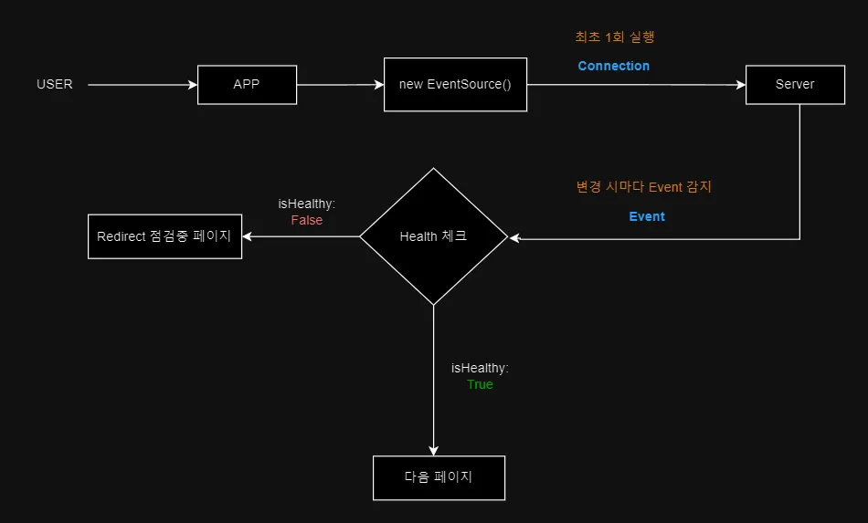

## 배경

서비스 특성상 빈번한 점검이 필요한 웹 애플리케이션 및 인게임 환경에서, 멀티 플랫폼의 각 게임 및 서비스별 헬스체크 요구사항이 증가하고 있음. 
기존의 정적 방식으로는 실시간 상태 파악과 즉각적인 대응이 어려운 상황이라 해당 요구사항을 적용하기 위한 검증이 필요했음

## 현재 시스템 (AS-IS)

기존 시스템은 CDN에 JSON 파일을 업로드 및 갱신하며 점검 정보를 관리하는 방식이었음

### 기존 시스템 동작 흐름

1. **웹 사이트 접근**: 사용자가 웹사이트에 접속
2. **미들웨어에서 CDN JSON 확인**: 서버 미들웨어가 CDN의 JSON 정보를 확인
3. **라우팅 처리**: JSON 정보에 따른 적절한 라우팅 처리

### 기존 시스템의 한계점

- **페이지 이동 시에만 작동**: 실시간 점검 상태 파악이 어려워 답답했음
- **이벤트 의존적**: 특정 이벤트가 발생해야만 추가 헬스체크가 가능했음
- **네트워크 오버헤드**: 잦은 네트워크 통신으로 성능이 떨어질 수 있었음
- **실시간 제어 한계**: CDN 기반이라 실시간 제어가 어려웠음

## 개선 요구사항

1. **실시간 헬스체크**: 사용자가 뭘 하지 않아도 실시간으로 상태 확인이 가능해야 함
2. **자동 반영**: 헬스체크 결과에 따라 자동으로 변화가 반영되어야 함

## 해결 방법: SSE (Server-Sent Events) 도입

### SSE란?

[Server-Sent Events(SSE)](https://developer.mozilla.org/ko/docs/Web/API/Server-sent_events/Using_server-sent_events)는 서버에서 클라이언트로 단방향 실시간 데이터 스트림을 제공하는 웹 기술

#### 작동 방식

1. **연결 설정**: 클라이언트가 HTTP 연결을 통해 서버에 SSE 요청
2. **지속적 연결**: 서버는 연결을 열어두고 필요할 때마다 데이터 전송
3. **실시간 수신**: 클라이언트는 이벤트 리스너를 통해 서버 메시지를 실시간 수신

#### 주요 특징

- **자동 재연결**: 연결이 끊어져도 자동으로 다시 연결을 시도함
- **표준 프로토콜**: HTTP/HTTPS를 사용해서 추가 프로토콜이 필요 없음
- **간단한 구현**: 가벼운 API로 쉽게 구현할 수 있음

### SSE vs WebSocket 비교

실시간 데이터 통신을 위한 기술로 WebSocket과 SSE가 자주 비교되는데, 한번 비교해보자.

| 특성          | WebSocket              | SSE (Server-Sent Events)   |
| ------------- | ---------------------- | -------------------------- |
| 통신 방향     | 양방향                 | 단방향 (서버 → 클라이언트) |
| 프로토콜      | ws:// 또는 wss://      | HTTP/HTTPS                 |
| 연결 유지     | 지속적                 | 자동 재연결                |
| 구현 복잡성   | 상대적으로 복잡        | 비교적 간단                |
| 데이터 형식   | 모든 형식              | 주로 텍스트 (JSON)         |
| 서버 부하     | 다수 연결 시 증가 가능 | 일반적으로 낮음            |
| 방화벽 친화성 | 일부 제한 가능         | 대부분 허용                |

### SSE 선택 이유

1. **단방향 통신 충분**: 서버에서 클라이언트로 정보만 전달하면 되기 때문임
2. **구현 간소화**: 복잡한 양방향 통신을 구현할 필요가 없음
3. **지속적 연결**: 실시간 업데이트에 최적화된 연결 방식임
4. **브라우저 호환성**: 대부분의 현대 브라우저에서 지원함

## 개선된 시스템 (TO-BE)

SSE를 도입한 새로운 시스템은 다음과 같이 개선되었음

### 새로운 시스템 동작 흐름

1. **SSE 연결 설정**: 클라이언트가 서버와 SSE 연결을 수립
2. **실시간 모니터링**: 서버에서 헬스체크 상태를 실시간으로 전송
3. **자동 상태 반영**: 클라이언트에서 수신된 정보에 따라 UI가 자동으로 업데이트

### 개선 효과

- **실시간성**: 페이지 새로고침 없이도 상태 변화가 즉시 반영됨
- **효율성**: 불필요한 네트워크 요청이 줄어듦
- **사용자 경험**: 점검 상태에 따라 자연스럽게 UI가 전환됨
- **확장성**: 다양한 서비스와 게임에 대한 통합 헬스체크가 가능함

## 결론

SSE를 활용한 실시간 헬스체크 시스템으로 전환함으로써, 기존의 정적 JSON 방식의 한계를 극복할 수 있었음. 
특히 멀티 플랫폼 환경에서의 실시간 상태 관리와 즉각적인 대응이 가능해져서 서비스의 안정성과 신뢰성이 크게 향상될 것을 기대하게됨
