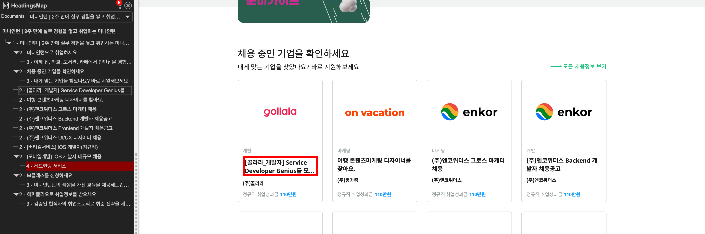
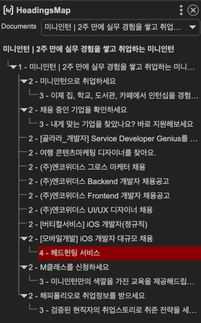
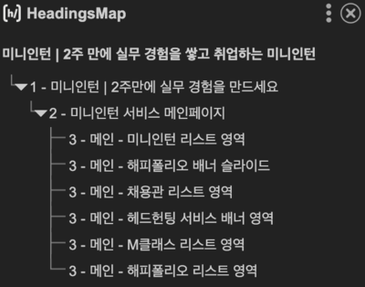
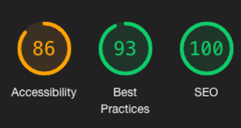
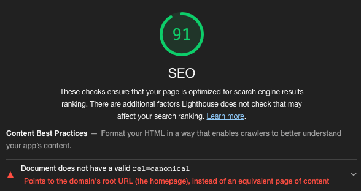
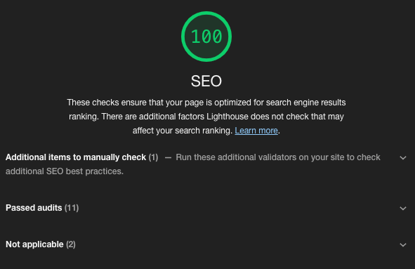

## 들어가기 앞서

### SEO가 무엇인가?

검색엔진 최적화로, 웹 사이트를 검색 엔진에서 높은 위치에서 노출시키기 위해 수행하는 작업을 의미한다.

### 왜 SEO를 해야하는가?

위에서 언급한대로 웹 사이트를 검색 엔진에 높은 위치에서 노출시키기 위해서다. 왜 그래야할까?

사용자들은 궁금한 것이 생기면 검색을 한다. 나의 경우엔 검색할 때 대부분 검색 리스트의 최상단에 노출된 링크를 먼저 클릭해본다.

왜냐하면 심리상 검색한 내용 부합한 내용이 많이 들어있을 것이라 기대하기 때문이다.

결국 검색엔진 최상단에 노출된다는 것은 내용의 신뢰성을 높일 수 있고 그에 따른 브랜딩이 될 수 있다고 판단된다.

### 어떻게 개선할 수 있지?

점유율이 가장 높은 구글 검색엔진이 동작하는 방식을 알아보자

[구글 검색엔진](https://developers.google.com/search/docs/fundamentals/how-search-works?hl=ko)은 세 단계로 작동한다.

1. 크롤링: 크롤러를 사용하여 인터넷에서 찾은 페이지로부터 텍스트, 이미지, 동영상을 다운로드한다.
2. 색인 생성: 구글은 페이지의 텍스트, 이미지, 동영상 파일을 분석하고 대규모 데이터 베이스인 구글 색인에 이 정보를 저장한다.
3. 검색결과 게재: 사용자가 검색시 구글은 사용자의 검색어와 관련된 정보를 반환

결국 개선하기 위해서는 크롤러의 눈길을 사로잡아 색인을 생성하게 해야한다.

### SEO가 개선되었는지 어떻게 확인할 수 있는가?

Google Chrome에서 제공하는 웹의 품질 개선에 도움을 주는 자동화 도구인 Lighthouse를 사용하여 성능, 접근성, SEO를 진단할 수 있다.

그렇다면 Lighthouse에서 SEO 판단 기준이 무엇인가?

1. 페이지 속도 개선: 페이지 로딩 속도가 빠를수록 Lighthouse SEO 점수가 높아진다. 따라서 이미지 최적화, 브라우저 캐싱, CSS/JS 압축 등의 작업을 통해 페이지 속도를 개선하여 SEO를 개선할 수 있다.
2. 웹사이트 보안: HTTPS 프로토콜을 사용하고, 보안 인증서를 적용하면 Lighthouse SEO 점수가 높아진다.
3. 모바일 최적화: 모바일 친화적인 웹사이트 디자인과 반응형 웹사이트 개발 등을 통해 모바일 사용자 경험을 개선할 수 있다.
4. **웹사이트 접근성**: 웹사이트의 접근성을 높이는 작업을 통해 Lighthouse SEO 점수를 높일 수 있다. HTML 문서 구조화, 이미지 대체 텍스트 제공 등의 작업을 통해 웹사이트 접근성을 개선할 수 있다.
5. 기타 최적화 작업: 기타 최적화 작업으로는 폰트 최적화, 콘텐츠 압축 등이 있다.

### 그 중 무엇을 개선한 것인가?

위의 판단 기준에서 웹사이트 접근성의 **HTML 문서 구조화**로 개선해보려고 한다.

## 개선내용

미니인턴 서비스의 헤딩 태그를 점검해보자!

헤딩 태그를 잘 써야되는 이유는 간단하다. 웹 브라우저에 노출되는 ‘페이지’는 말그대로 문서이다.
우리가 글을 읽을 때 목차를 확인하고, 내용을 읽기 전 제목을 읽을 때 명확한 제목이라면 뒤에 나오는 내용을 어느정도 추측할 수 있게 된다. 마크업을 글쓰기라고 생각한다면 글쓰기와 같이 작성해야된다고 생각한다. 그러므로 각각의 영역마다 주어지는 영역 타이틀이 있어야하며 강조 또는 대표하는 문구 또는 단어가 존재해야한다.

헤딩 태그를 적절히 사용하여 의미를 담은 html 문서를 만들어 SEO 최적화를 진행하자.

일단 미니인턴 서비스의 상황을 살펴보자



순서가 뒤죽박죽으로 쓰인 것을 확인됐다.

어느정도 예상은 했다. 미니인턴 서비스를 구축하면서 헤딩 태그 관련된 내용은 컨벤션으로 지정해놓지 않았기 때문에 개발자 개개인이 생각하는 중요도가 달라 발생한 문제라고 생각한다.

2 - [모바일개발] iOS 개발자 대규모 채용 안에
4 - 헤드헌팅 서비스

순서가 뒤죽박죽인 친구들만 문제가 있어보이지만 내가 보기엔 다른 곳에도 문제가 있다고 생각한다.

다른 곳은 바로



다른 문제는 위 이미지에 표시되어 있는 영역이 문제라고 생각됐다.

물론 강조는 할 수 있지만, 카드 리스트 타이틀에 H2와 같은 높은 레벨의 해딩 태그를 사용할 필요성이 있을까라는 의문이 든다.

만약 수정을 한다면 다음과 같이 진행할 것 같다.
H1 - 서비스 소개 문구

H2 - 해당 페이지에 대한 상세 타이틀

p - [골라라_개발자] Service Developer Genius를 모…

이런식으로 레벨을 조금 더 구체화 시키면 좋을 것 같다고 생각했다.

만약 페이지 타이틀 등 노출하기 어려운 디자인이라면 어떻게 처리하면 좋을까?
처음에는 해당 텍스트를 css의 display: none 시키면 되지않을까? 라고 생각했다.

```css
{
	display: none;
}
```

영역을 차지하지 않고, UI 상으로 노출되지도 않는다. 그럼 원했던 조건에 부합할까?

아니다, display: none 속성을 사용하면 웹 페이지를 읽는 웹 크롤러는 해당 텍스트를 읽지 못한다.

display: none은 단순 숨기는게 아닌 접근성 트리에서 해당 요소가 제거되기 때문이다.

그러면 어떻게 영역을 차지하지 않고, UI상으로 노출되지 않고, 접근성 트리에서 제거되지 않게 할까?

[MDN](https://developer.mozilla.org/ko/docs/Web/CSS/display#display_none)에서 display: none 속성에서 얘기하는 것은 CSS 속성의 조합을 사용해서 우회할 수 있다고 한다.

그래서 생각한 방법은 다음과 같이 css를 사용하는 것이다.

```css
{
	overflow: hidden;
	position: absolute;
	width: 1px;
	height: 1px;
	margin: -1px;
	background-color: transparent;
	clip: rect(0, 0, 0, 0);
	white-space: nowrap;
}

```

**속성 사용에 대한 설명**

- overflow - 영역 밖으로 빠져나오는 것(ex. 텍스트)이 있다면 짤라버리기 위해서 사용
- position - 영역을 차지하면 안되므로 normal flow에서 분리시키기 위해서 사용
- width, height - 가로값, 높이값 지정
- margin - 마이너스를 활용하여 0이 되게끔 만들어주었다.
- background-color - background default color는 흰색이므로 영역을 가리지 않기 위해 사용
- clip - 특정영역을 잘라서 보여주기 위해 사용
- white-space - width, height 값에 따라서 워딩이 세로로 떨어질 수 있기 때문에 한줄로 하기위해 사용

**수정 전**




**수정 후**






화면상으로는 변하는 것이 없다.
하지만 문서로 봤을 때는 많이 깔끔해지고 명확해졌다.

문서의 명확성이 올라감으로써 웹 크롤러는 우리 서비스를 조금 더 명확하게 파악하고 검색에 조금 더 좋은 효과를 가져줄 것이라 생각한다.

메인 페이지 검사는 끝났으니 다른 페이지들도 검사해보자



100점을 기대했는데 91점이 나왔다.

에러 메시지를 확인해보면 Canonical link에 관련된 내용을 체크하라고 한다.

> 💡 **Canonical Link가 무엇이지?**
> 사이트 내 URL 주소는 다르지만 동일한 내용의 중복된 페이지가 있을 때 페이지에 코드를 삽입하여 검색엔진에 대표되는 URL 주소를 알려주는 역할을 하는 태그이다.
> [Google 검색 센터의 문서](http://developers.google.com/search/docs/advanced/crawling/consolidate-duplicate-urls?hl=ko)를 읽어보면, 구글 봇은 비슷한 페이지를 가리키는 URL을 여러 개 발견하면 가장 적절하다고 생각되는 페이지의 URL을 표준으로 설정한다고 한다.
> 표준 URL로 지정되면, 구글 봇은 해당 표준 페이지를 가장 자주 크롤링하며, 중복된 페이지는 검색엔진의 자원을 절약하기 위해 표준 페이지보다 훨씬 적게 크롤링하게 된다.

그렇다면 우리 서비스는 어떻게 되어있을까?

```html
<link rel="canonical" href="https://miniintern.com" />
```

document.tsx에 고정적으로 작성되어 있어 모든 페이지가 miniintern.com으로 작성된다.

그렇다면 어떻게 유연하게 사용할 수 있을까? 우리 서비스는 Nextjs를 사용하고 있다. 페이지별 수정한다고 가정하면 추후에 페이지 만들 때마다 head 태그에 매번 작성해야하는 번거로움이 예상된다.

그렇다면 유연하게 하기위해 공용 컴포넌트를 만들어버리자!

```tsx
interface IProps {
	...
	title: string;
	description: string;
  pageHeadingTitle: string;
}

const WithHead: React.FC<IProps> = ({
  ...
	title,
	description,
  pageHeadingTitle,
}) => {
  const { pathname, asPath } = useRouter();
  const CURRENT_URL = `${process.env.CLIENT_URL}${asPath}`;

  return (
    <>
      <Head>
        ...
				<title>{title}</title>
				<meta name="description" content={description} key="description" />
        <link rel="canonical" href={CURRENT_URL} />
				...
      </Head>
      <h1 className="hidden-title">미니인턴 | 2주만에 실무 경험을 만드세요</h1>
      <h2 className="hidden-title">{pageHeadingTitle}</h2>
    </>
  );
};

export default WithHead;
```

페이지를 만들 때마다 작성해야하는 것은 동일하지만 페이지 title과 description, 상세 페이지에 대한 내용 등 만 넘겨주면 canonical tag와 h1을 신경 쓸 필요가 없어져서 상세 페이지 타이틀에 대한 내용만 신경써주면 된다.

비로소 WithHead 컴포넌트를 활용해서 Canonical link에 대한 대응 뿐만 아니라 &lt;h1&gt;(서비스 소개 문구)와 &lt;h2&gt;pageHeadingTitle(해당 페이지에 대한 상세 타이틀)을 유연하게 대응할 수 있게 됐다.
