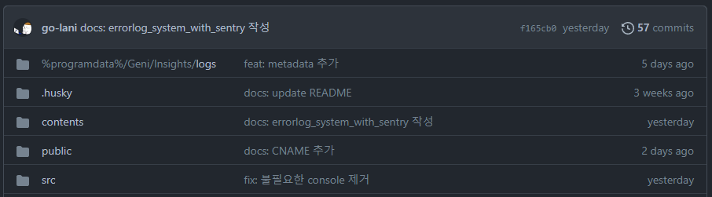
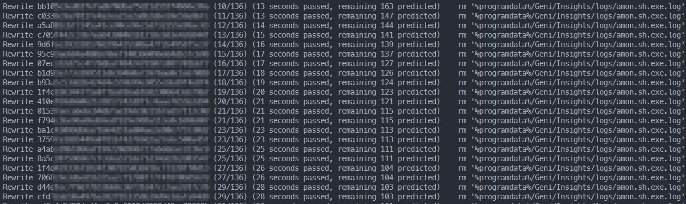

## 깃허브에 잘못 올린 파일 커밋 히스토리 삭제하기

### 특정 파일 history 제거

```bash
git filter-branch --force --index-filter 'git rm -r  --cached --ignore-unmatch <filename>' --prune-empty --tag-name-filter cat -- --all
```

### 제거된 커밋 Push

```bash
git push --force --all
```

### 예시

#### %programdata% 파일 삭제(전)



#### %programdata% 히스토리 제거



#### %programdata% 파일 삭제(후)


